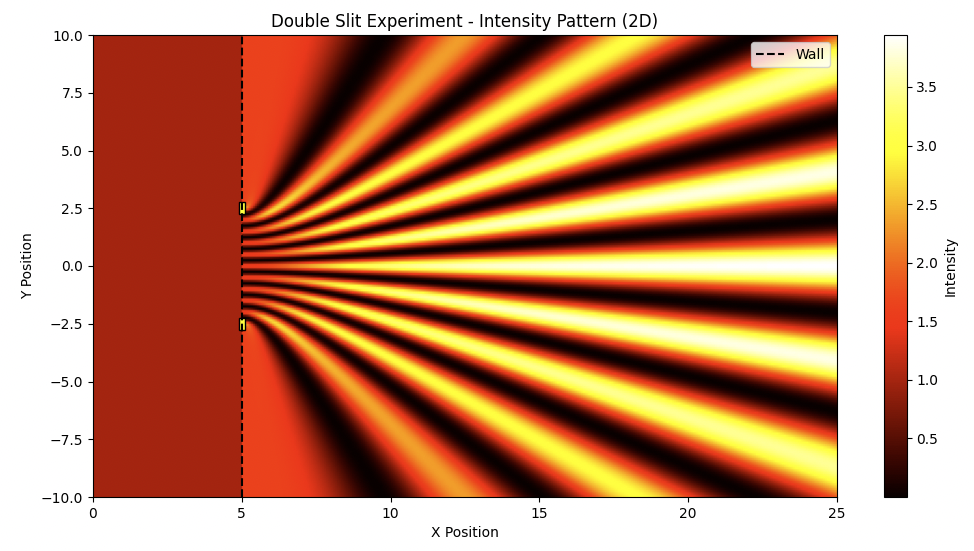

# Calculate LLM Embedding vectors similarities using Quantum Circuits

This archive contains the Python codes we used in the research article "[Quantum LLMs Using Quantum Computing to Analyze and Process Semantic Information](https://arxiv.org/pdf/2512.02619)".

# Complex Embeddings with Aer-Simulator

This section illustrates a quantum circuit approach to calculating the semantic similarity between the words "dog" and "cat." The specific circuit architecture used in this example is shown below.

The Python code implementing this approach, and leveraging Qiskit and the Aer simulator for calculations, is provided in the file `dogcat.py`.

# Sentence Transformer with IBM Quantum Computer

The second example uses demonstrates cosine similarity calculations using embedding vectors generated by a real-world LLM on a real quantum computer. We utilized Google's Sentence Transformer, '[google/embeddinggemma300m](https://huggingface.co/google/embeddinggemma-300m)', to create the embedding vectors. To reduce the dimensionality of the embeddings to fit within the qubit constraints of the available quantum hardware, we employed Matryoshka Representation Learning (MRL) to truncate the output to 128 dimensions. The quantum computations were executed on the IBM Quantum Cloud platform. This project showcases the potential of quantum computing for natural language processing tasks like semantic similarity analysis.

The Python code is provided in the file `qc_real.ipynb`.